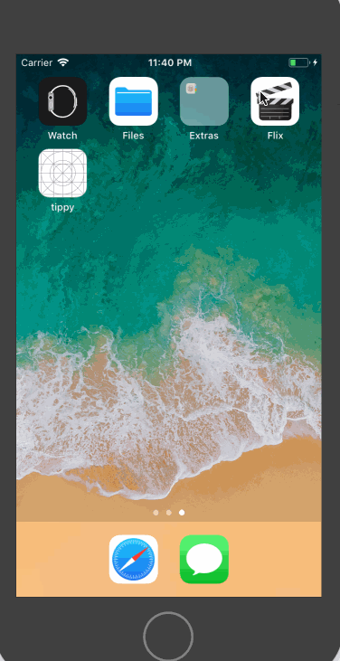

# Project 1 - *Flix_demo_03*

**Flix_demo_03** is a movies app using the [The Movie Database API](http://docs.themoviedb.apiary.io/#).

Time spent: **5** hours spent in total

## User Stories

The following **required** user stories are complete:

- [x] User sees app icon in home screen and styled launch screen (+1pt)
- [x] User can scroll through a list of movies currently playing in theaters from The Movie DB API (+5pt)
- [x] User can "Pull to refresh" the movie list (+2pt)
- [x] User sees a loading state while waiting for the movies to load (+2pt)

The following **stretch** user stories are implemented:

- [x] User sees an alert when there's a networking error (+1pt)
- [ ] User can search for a movie (+3pt)
- [ ] While poster is being fetched, user see's a placeholder image (+1pt)
- [ ] User sees image transition for images coming from network, not when it is loaded from cache (+1pt)
- [ ] Customize the selection effect of the cell (+1pt)
- [ ] For the large poster, load the low resolution image first and then switch to the high resolution image when complete (+2pt)

The following **additional** user stories are implemented:

- [x] List anything else that you can get done to improve the app functionality! (+1-3pts)

Please list two areas of the assignment you'd like to **discuss further with your peers** during the next class (examples include better ways to implement something, how to extend your app in certain ways, etc):

1.When json is failed to lookup initially, it would be great to show some sample data on frontend. Data can be fetched by running background activity every hour and cache. Although we are not that far into managing our caches, it would be great if we could do it.
2.When clicked on video links, it should redirect to some webpage with theater timeline of when the movie will be hosted as well as cost. Of course, we need to consider using another API to accomplish this. But it would be cool if we could do it.

## Video Walkthrough

Here's a walkthrough of implemented user stories:

GIF created with [LiceCap](http://www.cockos.com/licecap/).

## Notes
When trying to implement UI for NowPlayingViewController, I have trouble managing the width and length of labels and images. Problem was due to creation of ViewController.xib file which is used to give interactive view actions on XCode. Also I missplaced class name in content view section under moviecell which caused very weird UI Bugs. However, I was able to resolve those problems with the help of my peer. He has been very helpful with figuring and pinpointing the problems as well as troubleshooting some of XCode projects like Cocopads installation.

## License

    Copyright [2018] [MIT]

    Licensed under the Apache License, Version 2.0 (the "License");
    you may not use this file except in compliance with the License.
    You may obtain a copy of the License at

        http://www.apache.org/licenses/LICENSE-2.0

    Unless required by applicable law or agreed to in writing, software
    distributed under the License is distributed on an "AS IS" BASIS,
    WITHOUT WARRANTIES OR CONDITIONS OF ANY KIND, either express or implied.
    See the License for the specific language governing permissions and
    limitations under the License.

___________________________________________________________________________________________________________
# Project 2 - *Flix*

**Flix** is a movies app displaying box office and top rental DVDs using [The Movie Database API](http://docs.themoviedb.apiary.io/#).

Time spent: **10** hours spent in total

## User Stories

The following **required** functionality is completed:

- [x] User can tap a cell to see a detail view (+5pts)
- [x] User can tap a tab bar button to view a grid layout of Movie Posters using a CollectionView (+5pts)

The following **stretch** features are implemented:

- [x] User can tap a poster in the collection view to see a detail screen of that movie (+3pts)
- [ ] In the detail view, when the user taps the poster, a new screen is presented modally where they can view the trailer (+3pts)
- [ ] Customize the navigation bar (+1pt)
- [x] List in any optionals you didn't finish from last week (+1-3pts)
- search bar was not implemented
- custom refreshing animation is not implemented.

The following **additional** features are implemented:

- [x] List anything else that you can get done to improve the app functionality!

Please list two areas of the assignment you'd like to **discuss further with your peers** during the next class (examples include better ways to implement something, how to extend your app in certain ways, etc):

1. Implementation of Tomato Review and rating of the movies.
2. Theaters that is playing those movies as well as prices.

## Video Walkthrough

Here's a walkthrough of implemented user stories:

GIF created with [LiceCap](http://www.cockos.com/licecap/).

## Notes

Describe any challenges encountered while building the app.

## License

Copyright [2018] [Wai Yan Phyo Hein]

Licensed under the Apache License, Version 2.0 (the "License");
you may not use this file except in compliance with the License.
You may obtain a copy of the License at

http://www.apache.org/licenses/LICENSE-2.0

Unless required by applicable law or agreed to in writing, software
distributed under the License is distributed on an "AS IS" BASIS,
WITHOUT WARRANTIES OR CONDITIONS OF ANY KIND, either express or implied.
See the License for the specific language governing permissions and
limitations under the License.
___________________________________________________________________________________________________________
